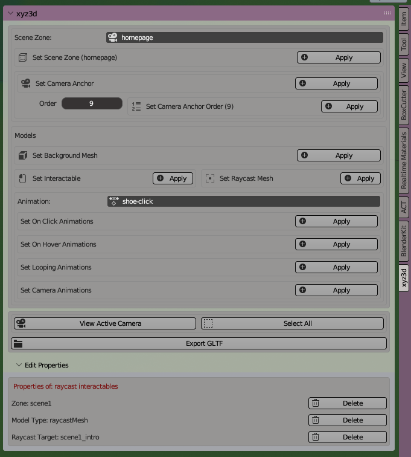
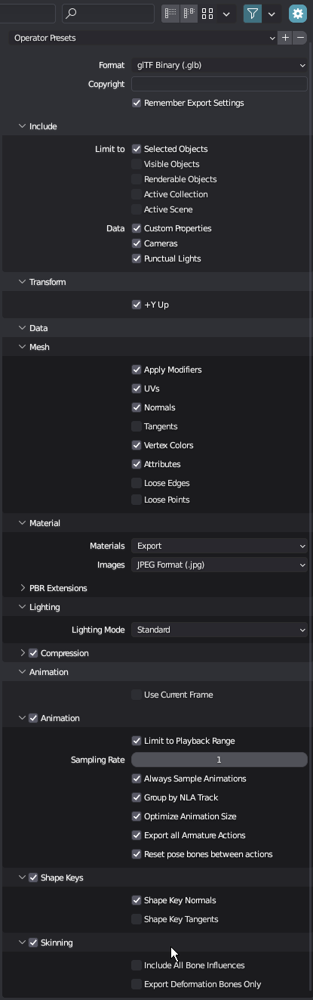

# xyz3d.js Blender Plugin

This plugin adds custom properties to the selected objects which are read by the xyz3d.js library.

## how to use

---

## Models

Select an object and while it's the active object choose a corresponding option in the models section.

#### INTERACTABLE MESHES

If the object is "clickable" or "hoverable"

1. set it as "interactable"
2. add a bounding (convex) mesh around it that will work as bounds the user clicks
3. set viewport visibility of this convex mesh to bounds only
4. click the convex mesh, then it's interactable mesh counterpart, and select "Set Raycast Mesh". (AKA selected=interactable, active=raycast mesh)

#### SCENE ZONES

These define where in your 3d scene the camera should be when navigating your site. This is similar to how websites are often divided into multiple areas or pages, such as the "HomePage" "Shop" "About Us" etc.

1. Create a box (optionally set visibility to bounds)
2. Move the box where you would like the camera to be
3. Set the name of the zone, click the box, click "Apply" to "Set Zone" (pictured is shop)
4. Select the meshes corresponding to this zone and also click "Apply" to "Set Zone"
5. Repeat for all sections of the site
6. As a convenience, set the index of the zones in the order they should be seen. "HomePage" or is usually index:1 for example.

#### ANIMATIONS

## gltf export settings

